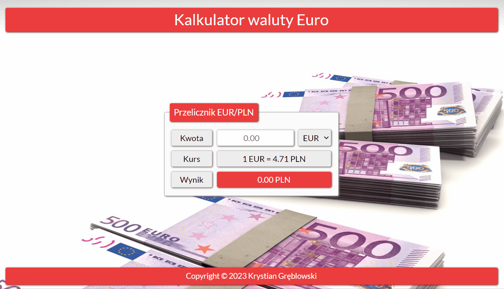

# Currency converter

It's a currency converter for the euro and the Polish currency. 

It's an application I created as part of a project for the YouCode Frontend Developer course.

## Preview

## Demo

[Click here](https://krystiangreblowski.github.io/currency-converter/)

## Technology used

