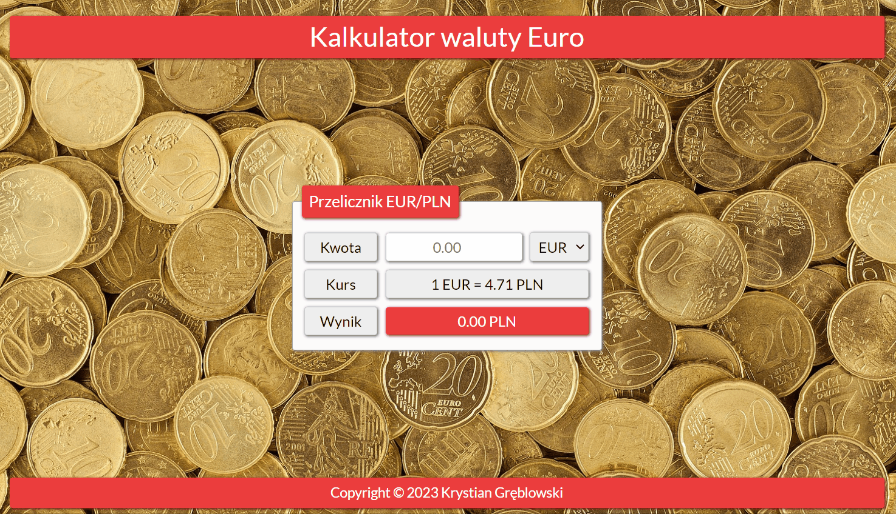

# Currency converter

## Description

It's a currency converter for the euro and the Polish currency. It's an application I created as part of a project for the YouCode Frontend Developer course.

## Demo

[Currency converter](https://krystiangreblowski.github.io/currency-converter/)

## Preview

## Technologies
- HTML
- CSS
- JavaScript(ES6+)
